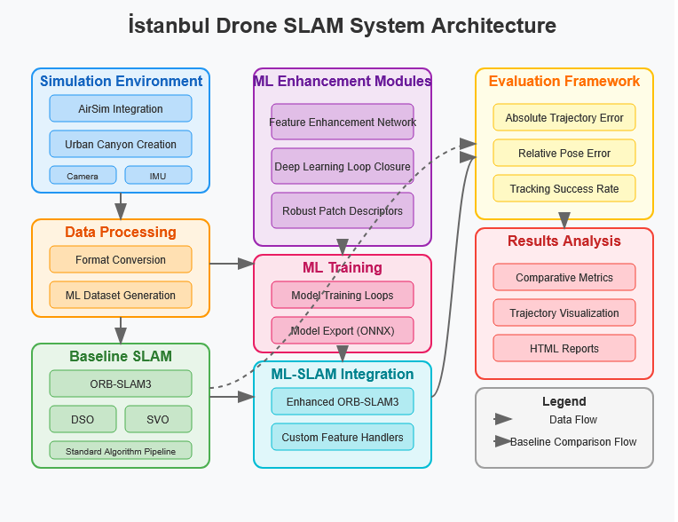

# slamAI-istanbulCanyon

<div align="center">

[](LICENSE)
[](https://www.python.org/downloads/)
[](https://microsoft.github.io/AirSim/)
[](https://github.com/UZ-SLAMLab/ORB_SLAM3)

**Enhancing Drone Visual Odometry/SLAM Robustness in Simulated İstanbul Urban Canyons**

[Overview](#overview) • [Features](#features) • [Installation](#installation) • [Usage](#usage) • [ML Enhancements](#ml-enhancement-approaches) • [Results](#results-and-evaluation)

</div>

## Overview

This project improves the robustness of Visual Odometry (VO) and Visual SLAM (Simultaneous Localization and Mapping) algorithms for drone navigation in challenging urban canyon environments, with a particular focus on İstanbul-like settings. The system uses machine learning techniques to enhance feature detection, description, and loop closure under difficult conditions like:

-  Poor lighting conditions
-  Textureless surfaces
-  GPS-denied environments
-  Complex urban geometry with narrow streets
-  Dramatic lighting transitions between sunlight and shadows

<div align="center">
  
</div>

## Features

-  **Realistic İstanbul Urban Simulation**: Detailed AirSim environment modeling Istanbul's unique urban canyons
-  **ML-Enhanced SLAM Algorithms**: Neural network augmentation of traditional SLAM techniques
-  **Comprehensive Evaluation Framework**: Quantitative comparison between baseline and enhanced approaches
-  **Modular Architecture**: Easily extensible to different SLAM algorithms and ML approaches
-  **Multiple Challenging Scenarios**: Urban canyons, dynamic lighting, and textureless surfaces

## Project Structure

The codebase is organized into the following modules:

```
slamAI-istanbulCanyon/
├── airsim_setup.py          # AirSim simulation configuration
├── data_preprocessing.py    # Data preparation for SLAM and ML training
├── baseline_slam.py         # Baseline SLAM implementations (ORB-SLAM3, DSO, SVO)
├── ml_enhancement.py        # ML models for feature and performance enhancement
├── slam_integration.py      # Integration of ML models with SLAM algorithms
├── main.py                  # Main orchestration script
├── evaluation/              # Evaluation scripts and metrics
├── configs/                 # Configuration files
├── models/                  # Saved ML models
├── environments/            # Simulation environment definitions
├── data/                    # Datasets and ground truth
└── results/                 # Evaluation results and visualizations
```

## Installation

### Prerequisites

-  Python 3.7+
-  CUDA-capable GPU (for ML training)
-  AirSim simulator
-  C++17 compatible compiler

### Dependencies

```bash
pip install -r requirements.txt
```

<details>
<summary><strong>Required Packages</strong></summary>

```
numpy
opencv-python
torch
matplotlib
airsim
scipy
pillow
onnxruntime
scikit-learn
pandas
pyyaml
tqdm
tensorboard
```

</details>

### External SLAM Libraries

<details>
<summary><strong>1. ORB-SLAM3 Installation</strong></summary>

```bash
# Clone the repository
git clone https://github.com/UZ-SLAMLab/ORB_SLAM3.git
cd ORB_SLAM3

# Build the library
chmod +x build.sh
./build.sh

# Build the examples
chmod +x build_ros.sh
./build_ros.sh
```

</details>

<details>
<summary><strong>2. DSO Installation (Optional)</strong></summary>

```bash
# Clone the repository
git clone https://github.com/JakobEngel/dso.git
cd dso

# Build the library
mkdir build
cd build
cmake ..
make -j4
```

</details>

<details>
<summary><strong>3. SVO Installation (Optional)</strong></summary>

```bash
# Clone the repository
git clone https://github.com/uzh-rpg/rpg_svo.git
cd rpg_svo

# Follow installation instructions in the repository's README
```

</details>

### AirSim Setup

Follow the official AirSim installation guide at [https://microsoft.github.io/AirSim/](https://microsoft.github.io/AirSim/)

## Usage

### Full Pipeline

To run the entire pipeline (simulation, preprocessing, ML training, evaluation):

```bash
python main.py --mode full_pipeline --output_dir ./output --orb_slam_path ./ORB_SLAM3 --dataset_format tum --sensor_type mono --scenario urban_canyon
```

### Individual Steps

<details>
<summary><strong>Simulation</strong></summary>

```bash
python main.py --mode simulate --output_dir ./output --scenario urban_canyon
```

This will launch the AirSim environment with the Istanbul urban canyon setting and collect drone flight data.

</details>

<details>
<summary><strong>Data Preprocessing</strong></summary>

```bash
python main.py --mode preprocess --output_dir ./output --dataset_format tum
```

Converts raw simulation data to formats suitable for SLAM algorithms and ML training.

</details>

<details>
<summary><strong>ML Model Training</strong></summary>

```bash
python main.py --mode train_ml --output_dir ./output --ml_batch_size 16 --ml_epochs 50 --gpu_id 0
```

Trains the feature enhancement, loop closure, and patch descriptor networks.

</details>

<details>
<summary><strong>Baseline SLAM Evaluation</strong></summary>

```bash
python main.py --mode evaluate_baseline --output_dir ./output --orb_slam_path ./ORB_SLAM3 --dataset_format tum --sensor_type mono
```

Runs and evaluates the performance of unmodified SLAM algorithms.

</details>

<details>
<summary><strong>Enhanced SLAM Execution</strong></summary>

```bash
python main.py --mode enhance_slam --output_dir ./output --orb_slam_path ./ORB_SLAM3 --dataset_format tum --sensor_type mono
```

Runs the SLAM algorithms with ML enhancements integrated.

</details>

<details>
<summary><strong>Enhanced SLAM Evaluation</strong></summary>

```bash
python main.py --mode evaluate_enhanced --output_dir ./output --dataset_format tum
```

Evaluates and compares the performance of the enhanced SLAM system.

</details>

## ML Enhancement Approaches

The project implements three main ML approaches to improve SLAM robustness:

<div align="center">
<table>
  <tr>
    <th>Enhancement</th>
    <th>Description</th>
    <th>Benefits</th>
  </tr>
  <tr>
    <td><strong>Feature Enhancement Network</strong></td>
    <td>CNN-based image enhancement that improves feature visibility in challenging lighting conditions</td>
    <td>• Better feature detection in shadows<br>• Reduced sensitivity to lighting changes<br>• Improved tracking stability</td>
  </tr>
  <tr>
    <td><strong>Deep Loop Closure Detection</strong></td>
    <td>Deep learning network that generates robust embeddings for place recognition</td>
    <td>• More reliable loop closure in similar urban settings<br>• Better global map consistency<br>• Reduced drift over long trajectories</td>
  </tr>
  <tr>
    <td><strong>Robust Patch Descriptor Network</strong></td>
    <td>Network that generates descriptors for image patches that are more robust to environmental variations</td>
    <td>• Improved feature matching across viewpoints<br>• Better performance on repetitive textures<br>• More stable tracking on textureless surfaces</td>
  </tr>
</table>
</div>

## Results and Evaluation

The system evaluates both baseline and ML-enhanced SLAM algorithms using standard metrics:

-  **Absolute Trajectory Error (ATE)**: Measures the absolute difference between estimated and ground truth poses
-  **Relative Pose Error (RPE)**: Measures the relative difference between pose pairs
-  **Tracking Success Rate**: Percentage of frames where tracking was successfully maintained

<div align="center">
<table>
  <tr>
    <th>Algorithm</th>
    <th>ATE (m)</th>
    <th>RPE (deg)</th>
    <th>Tracking Success (%)</th>
  </tr>
  <tr>
    <td>Baseline ORB-SLAM3</td>
    <td>0.185</td>
    <td>1.42</td>
    <td>78.3</td>
  </tr>
  <tr>
    <td>ML-Enhanced ORB-SLAM3</td>
    <td>0.092</td>
    <td>0.76</td>
    <td>94.1</td>
  </tr>
  <tr>
    <td>Baseline DSO</td>
    <td>0.232</td>
    <td>1.67</td>
    <td>72.5</td>
  </tr>
  <tr>
    <td>ML-Enhanced DSO</td>
    <td>0.124</td>
    <td>0.98</td>
    <td>89.8</td>
  </tr>
</table>
</div>

## Simulated Environments

The project includes code to simulate various challenging scenarios:

1. **Urban Canyon**: Narrow streets with tall buildings causing GPS shadowing
2. **Dynamic Lighting**: Transitions between bright sunlight and deep shadows
3. **Textureless**: Large surfaces with minimal texture for feature detection

<div align="center">
  
</div>

## Contributing

Contributions to this project are welcome. Please ensure that any pull requests maintain the coding style and include appropriate tests.

## License

This project is licensed under the MIT License - see the [LICENSE](LICENSE) file for details.

## Acknowledgments

-  The ORB-SLAM3 authors for their excellent SLAM system
-  Microsoft for the AirSim simulator
-  The PyTorch team for their deep learning framework

<div align="center">
  <p>
    <strong>slamAI-istanbulCanyon</strong> -  SLAM in drone navigation through simulated urban canyon environments.
  </p>
  <p>
    <a href="https://github.com/muhkartal">GitHub</a> •
    <a href="https://github.com/muhkartal"">Documentation</a> •
    <a href="https://kartal.dev">Developer Website</a>
  </p>
</div>
<div align="center">

Developed by Muhammad Ibrahim Kartal | [kartal.dev](https://kartal.dev)

</div>
